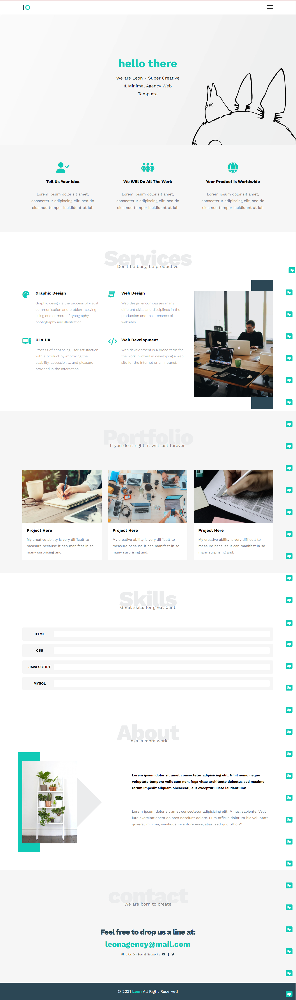

<h2>About the project</h2>

  
A <b>Leon</b> is a responsive website template built with HTML and CSS. In addition, Add some future with javascript. It is a modern and minimalist template that is perfect for a variety of websites, including portfolios, blogs, and business websites.

The template features a clean and uncluttered design with a focus on user experience. It is also fully responsive, so it will look great on any device.

<h5>Some of the key features of Leon include:</h5>
<ul>
  <li>A modern and minimalist design</li>
  <li>Fully responsive layout</li>
  <li>Clean and uncluttered code</li>
  <li>Easy to customize</li>
  <li>Well-documented code</li>
</ul>

👉 Live Demo: <a href='https://leon-flame.vercel.app/'>Live Demo</a>

<h3>Build with:</h3>

» HTML  
» CSS  
» Javascript

<h2>Screenshots of the Project 📸</h2>
 
<h3 align='center'>Home Page 🏡</h3>

